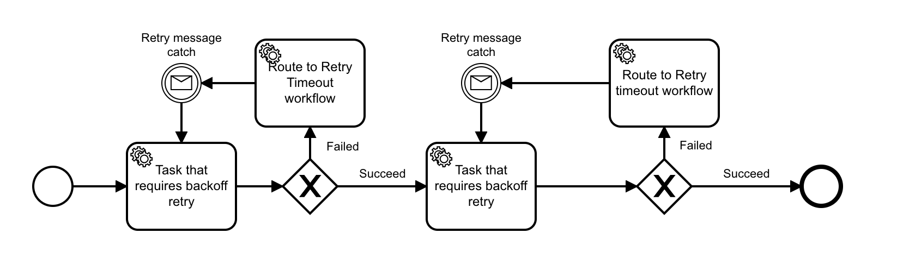

# Zeebe Exponential Backoff Retry

An exponential back-off retry pattern for Zeebe.

## The Problem

You have a Zeebe task that should be retried on failure, but not immediately.

Maybe it accesses a rate-limited external API, or causes some costly side-effect.

In this case, you want it to be retried on failure, but not immediately.

The Camunda workflow engine provides `retryTimeout` as a first-class property of external tasks to support this functionality. Zeebe has no such primitive. The Zeebe broker schedules failed tasks with retries for immediate re-execution.

## A Solution

You can implement a Retry Timeout Workflow to schedule the retry.

A failed task is completed as usual in the worker, but a flag is set in the workflow variables such that the workflow token is sent to the `Route to Retry Timeout Workflow`. Some other variable can be set to determine which Retry Timeout Workflow it is routed to. This allows exponential backoff (increasing timeouts for each attempt).

The routing task then spawns a timeout workflow, which simply looks like this:

When the timer has expired, the task publishes a message that is correlated with the Retry Message Catch in the main workflow, and the task is retried.
